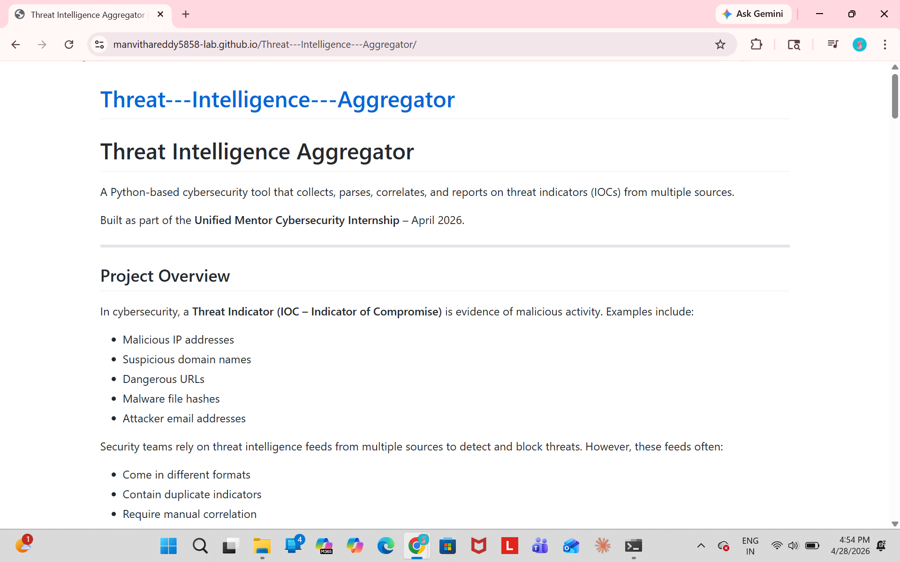
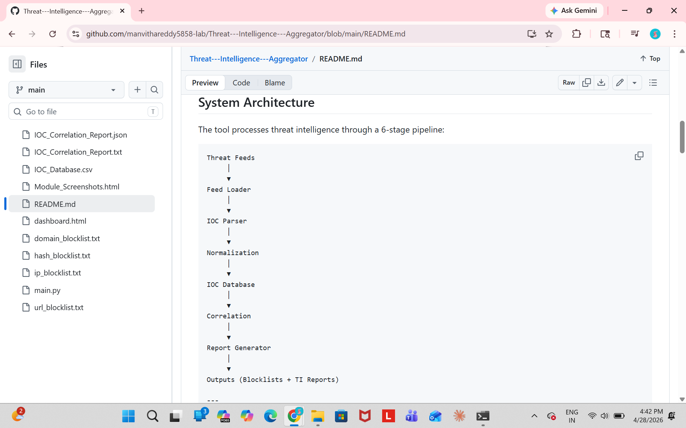
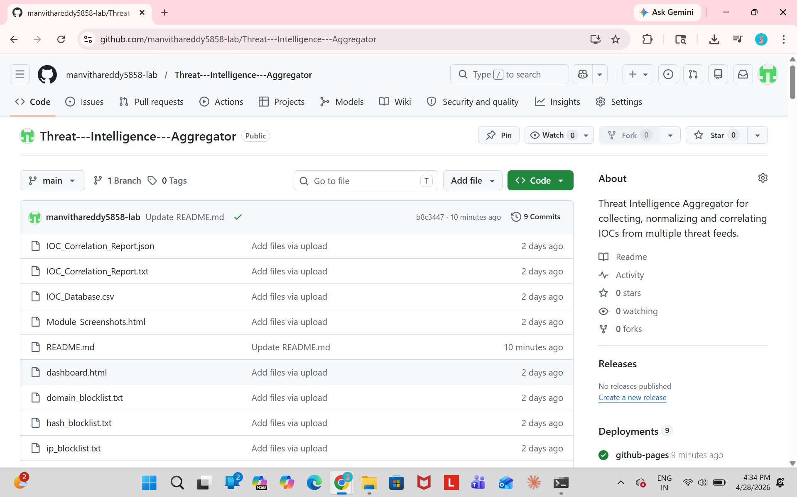

# Threat Intelligence Aggregator

A Python-based cybersecurity tool that collects, parses, correlates, and reports on threat indicators (IOCs) from multiple sources.

Built as part of the **Unified Mentor Cybersecurity Internship** – April 2026.

---

## Project Overview

In cybersecurity, a **Threat Indicator (IOC – Indicator of Compromise)** is evidence of malicious activity. Examples include:

- Malicious IP addresses
- Suspicious domain names
- Dangerous URLs
- Malware file hashes
- Attacker email addresses

Security teams rely on threat intelligence feeds from multiple sources to detect and block threats. However, these feeds often:

- Come in different formats
- Contain duplicate indicators
- Require manual correlation
- Are difficult to convert into usable blocklists

## Project Screenshots

### Dashboard


### Architecture


### Threat Intelligence Results


**This tool automates that entire workflow.**

**Give it a folder of threat feeds → it produces cleaned blocklists and a full intelligence report.**

---

## Key Features

- Multi-format threat feed ingestion (CSV, TXT, JSON)
- Regex-based IOC extraction
- Indicator validation and normalization
- Cross-feed IOC correlation
- Risk scoring engine (0–100)
- Automated blocklist generation
- Human-readable and machine-readable reports
- Modular Python architecture
- Uses only Python standard library (no external dependencies)

---

## How to Run the Project

1. Clone the repository

git clone https://github.com/manvithareddy5858-lab/Threat---Intelligence---Aggregator.git

2. Navigate to the project directory

cd Threat---Intelligence---Aggregator

3. Open the project

Open the **index.html** file in a web browser to view the Threat Intelligence Aggregator dashboard.

Alternatively you can view the live deployed version:

https://manvithareddy5858-lab.github.io/Threat---Intelligence---Aggregator/

---

## System Architecture

The tool processes threat intelligence through a 6-stage pipeline:

Threat Feeds
     │
     ▼
Feed Loader
     │
     ▼
IOC Parser
     │
     ▼
Normalization 
     │
     ▼
IOC Database
     │
     ▼
Correlation
     │
     ▼
Report Generator
     │
     ▼
Outputs (Blocklists + TI Reports)

---

## How It Works

1. **Load Feeds** — reads all threat feed files from a directory (CSV, TXT, JSON supported)
2. **Parse IOCs** — extracts IP addresses, domains, URLs, file hashes, and emails using regex
3. **Normalize** — validates and cleans everything; removes duplicates, filters private IP ranges, standardizes metadata
4. **Correlate** — checks which indicators appear in multiple feeds and scores them by risk (0–100)
5. **Generate Blocklists** — writes 8 ready-to-deploy blocklist files for different security tools
6. **Report** — produces a full intelligence report in TXT, JSON, and CSV formats

---

## How to Run

```bash
# Basic run — processes all files in the feeds/ folder
python main.py

# Use a custom feed directory
python main.py --feeds /path/to/your/feeds

# Only include higher-risk indicators
python main.py --min-score 30

# Specify all parameters
python main.py --feeds ./feeds --output ./results --min-score 25
```

No installation needed. Uses Python 3 standard library only.

---

## Example Execution Output

```
python main.py --feeds ./feeds

[+] Loading feeds...
[+] Parsing indicators...
[+] Normalizing data...
[+] Running correlation engine...
[+] Generating blocklists...
[+] Writing TI report...

Pipeline complete.
```

---

## Project Structure

```
ti_aggregator/
│
├── main.py                  ← Run this to start the tool
├── requirements.txt         ← No external packages needed
├── README.md
│
├── feeds/                   ← Put your threat feed files here
│   ├── feed1_ips.csv
│   ├── feed2_mixed.txt
│   └── feed3_structured.json
│
├── modules/                 ← Core processing modules
│   ├── parser.py            ← Feed parser
│   ├── normalizer.py        ← Data normalization & validation
│   ├── correlator.py        ← IOC correlation engine
│   ├── blocklist_gen.py     ← Blocklist generation
│   └── reporter.py          ← Report generation
│
└── output/
    ├── blocklists/
    │   ├── ip_blocklist.txt
    │   ├── domain_blocklist.txt
    │   ├── url_blocklist.txt
    │   ├── hash_blocklist.txt
    │   ├── email_blocklist.txt
    │   ├── master_blocklist.csv
    │   ├── master_blocklist.json
    │   └── high_risk_only.csv
    └── reports/
        ├── ti_report.txt
        ├── ti_report.json
        └── ioc_database.csv
```

---

## Feed Formats Supported

| Format | Extension | Notes |
|--------|-----------|-------|
| CSV | .csv | Must include columns: indicator, type, severity, source |
| Plain Text | .txt | One indicator per line; lines starting with `#` are ignored |
| JSON | .json | Must contain an `indicators` array of objects |

---

## IOC Types Supported

| Type | Example |
|------|---------|
| IP Address | 185.220.101.45 |
| Domain | malware.evil-domain.ru |
| URL | http://malicious-site.net/payload.exe |
| File Hash (MD5/SHA1/SHA256) | 44d88612fea8a8f36de82e1278abb02f |
| Email Address | attacker@evil-domain.ru |

---

## Risk Scoring

Every indicator receives a score between **0 and 100**:

- Starts with a base score based on severity (Low = 5, Medium = 15, High = 30, Critical = 40)
- Gets **+10 points** for every additional feed it appears in (up to +30)
- Gets **+10 bonus points** if it appears in 3 or more feeds
- Final score is capped at 100

**Score thresholds:** Critical ≥ 75 | High ≥ 50 | Medium ≥ 25 | Low < 25

---

## Sample Results (Test Run)

- Feeds processed: **4**
- Raw indicators collected: **57**
- Valid unique indicators after normalization: **35**
- Indicators appearing in multiple feeds: **13**
- High-risk indicators (score ≥ 50): **3**
- Blocklist files generated: **8**
- Pipeline runtime: **< 1 second**

---

## Output Files

### Blocklists

| File | Used With |
|------|-----------|
| ip_blocklist.txt | iptables, pfSense, Palo Alto |
| domain_blocklist.txt | DNS filtering / Pi-hole |
| url_blocklist.txt | Web proxies (Squid, Nginx) |
| hash_blocklist.txt | EDR / Antivirus (CrowdStrike, Defender, YARA) |
| email_blocklist.txt | Email security gateways (SpamAssassin, Postfix, M365) |
| master_blocklist.csv | SIEM ingestion — all IOC types |
| master_blocklist.json | API / SOAR integration |
| high_risk_only.csv | Immediate threat response (score ≥ 50) |

### Reports

| File | Description |
|------|-------------|
| ti_report.txt | Human-readable threat intelligence report |
| ti_report.json | Structured report for automation |
| ioc_database.csv | Full IOC dataset — complete spreadsheet |

---

## Libraries Used

All modules are from the **Python Standard Library** — no `pip install` required:

| Library | Purpose |
|---------|---------|
| re | IOC pattern extraction via regex |
| csv | CSV feed parsing and export |
| json | JSON feed parsing and report output |
| os | File system operations |
| ipaddress | IP address validation and RFC 1918 filtering |
| datetime | Timestamping indicators |
| argparse | Command-line interface |

---

## Example Threat Intelligence Output

The system aggregates Indicators of Compromise (IOCs) such as:

IP Address:
185.220.101.1

Domain:
malicious-example.com

URL:
http://phishing-site-login.com

File Hash (MD5):
5d41402abc4b2a76b9719d911017c592

These indicators represent potentially malicious activity collected from multiple threat intelligence sources.

---

## Live Demo

🔗 [Open Threat Intelligence Dashboard](https://manvithareddy5858-lab.github.io/Threat---Intelligence---Aggregator/dashboard.html)
🔗 [Open Deployed Threat Intelligence Aggregator](https://manvithareddy5858-lab.github.io/Threat---Intelligence---Aggregator/)

## Future Improvements

Potential enhancements for future development:

- Support for STIX/TAXII threat intelligence feeds
- Integration with SIEM platforms (Splunk, ELK)
- Real-time ingestion from OSINT threat feeds
- Web dashboard for IOC visualization
- IOC enrichment using reputation APIs

---

## Learning Outcomes

This project demonstrates practical knowledge of:

- Threat Intelligence processing and IOC lifecycle
- Indicator normalization, deduplication, and enrichment
- Cross-feed correlation techniques used in real SOC platforms
- Blocklist deployment for firewalls, DNS sinkholes, EDR, and email gateways
- SOC automation workflows that reduce analyst workload
- Modular Python-based security tooling and CLI design

---

## License

*Unified Mentor Cybersecurity Internship — April 2026*
